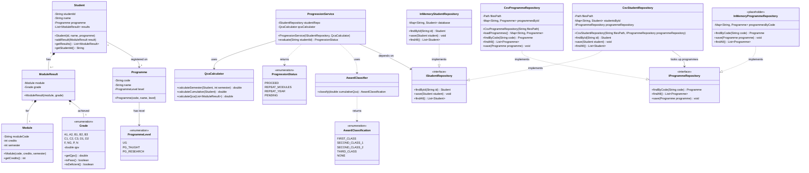

```mermaid
classDiagram
  %% ================= Model Layer =================
  class Student {
      -String studentId
      -String name
      -Programme programme
      -List~ModuleResult~ results
      +Student(id, name, programme)
      +addResult(ModuleResult result)
      +getResults() List~ModuleResult~
      +getStudentId() String
  }

  class Programme {
      -String code
      -String name
      -ProgrammeLevel level
      +Programme(code, name, level)
  }

  class ProgrammeLevel {
      <<enumeration>>
      UG
      PG_TAUGHT
      PG_RESEARCH
  }

  class Module {
      -String moduleCode
      -int credits
      -int semester
      +Module(code, credits, semester)
      +getCredits() int
  }

  class ModuleResult {
      -Module module
      -Grade grade
      +ModuleResult(module, grade)
  }

  class Grade {
      <<enumeration>>
      A1, A2, B1, B2, B3
      C1, C2, C3, D1, D2
      F, NG, P, N
      -double qpv
      +getQpv() double
      +isPass() boolean
      +isDeficient() boolean
  }

  %% Model Relationships
  Student "1" *-- "0..*" ModuleResult : has
  Student "1" --> "1" Programme : registered on
  Programme --> ProgrammeLevel : has level
  ModuleResult "1" *-- "1" Module : for
  ModuleResult "1" *-- "1" Grade : achieved

  %% ================= Service Layer =================
  class QcaCalculator {
      +calculateSemester(Student, int semester) double
      +calculateCumulative(Student) double
      +calculateQca(List~ModuleResult~) double
  }

  class ProgressionService {
      -IStudentRepository studentRepo
      -QcaCalculator qcaCalculator
      +ProgressionService(IStudentRepository, QcaCalculator)
      +evaluate(String studentId) ProgressionStatus
  }

  class ProgressionStatus {
      <<enumeration>>
      PROCEED
      REPEAT_MODULES
      REPEAT_YEAR
      PENDING
  }

  class AwardClassifier {
      +classify(double cumulativeQca) AwardClassification
  }

  class AwardClassification {
      <<enumeration>>
      FIRST_CLASS
      SECOND_CLASS_1
      SECOND_CLASS_2
      THIRD_CLASS
      NONE
  }

  %% Service Relationships
  ProgressionService --> QcaCalculator : uses
  ProgressionService ..> ProgressionStatus : returns
  AwardClassifier ..> AwardClassification : returns
  ProgressionService ..> AwardClassifier : uses

  %% ================= Repository Layer =================
  class IStudentRepository {
      <<interface>>
      +findById(String id) Student
      +save(Student student) void
      +findAll() List~Student~
  }

  %% Dependency Injection
  ProgressionService --> IStudentRepository : depends on

  %% ================= Persistence Layer =================
  class InMemoryStudentRepository {
      -Map~String, Student~ database
      +findById(String id) Student
      +save(Student student) void
      +findAll() List~Student~
  }

  class CsvStudentRepository {
      -Path filesPath
      -Map~String, Student~ studentsById
      -IProgrammeRepository programmeRepository
      +CsvStudentRepository(String filesPath, IProgrammeRepository programmeRepository)
      +findById(String id) Student
      +save(Student student) void
      +findAll() List~Student~
  }

  class IProgrammeRepository {
      <<interface>>
      +findByCode(String code) Programme
      +findAll() List~Programme~
      +save(Programme programme) void
  }

  class CsvProgrammeRepository {
      -Path filesPath
      -Map~String, Programme~ programmesById
      +CsvProgrammeRepository(String filesPath)
      +loadProgrammes() Map~String, Programme~
      +findByCode(String code) Programme
      +findAll() List~Programme~
      +save(Programme programme) void
  }

  class InMemoryProgrammeRepository {
      <<placeholder>>
      -Map~String, Programme~ programmesByCode
      +findByCode(String code) Programme
      +save(Programme programme) void
      +findAll() List~Programme~
  }

  InMemoryStudentRepository ..|> IStudentRepository : implements
  CsvStudentRepository ..|> IStudentRepository : implements
  CsvProgrammeRepository ..|> IProgrammeRepository : implements
  InMemoryProgrammeRepository ..|> IProgrammeRepository : implements
  CsvStudentRepository --> IProgrammeRepository : looks up programmes
```