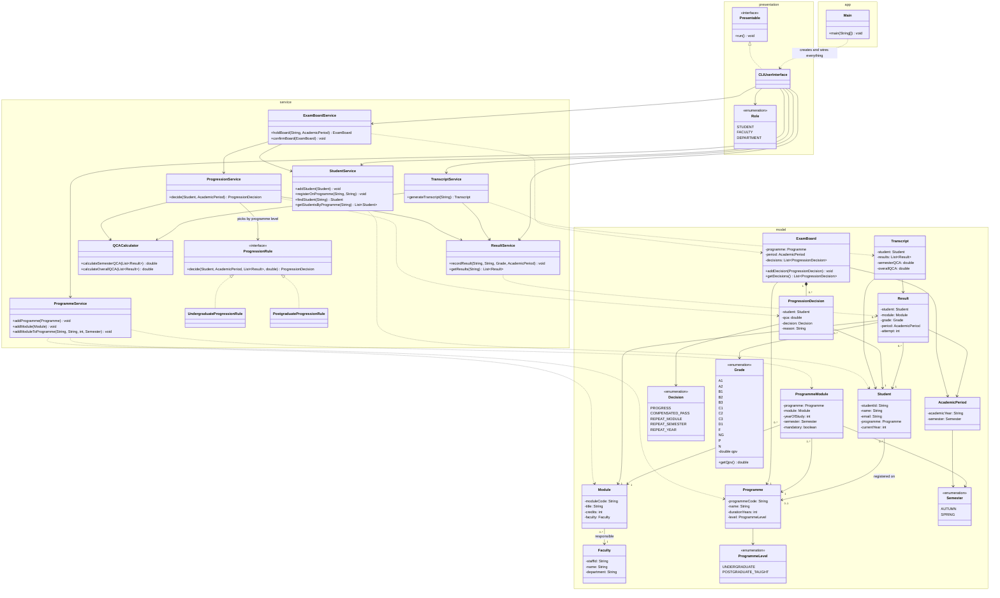

```mermaid
classDiagram
    direction TB

    %% =============== APP ===============
    namespace app {
        class Main {
            +main(String[]) void
        }
    }

    %% =============== PRESENTATION ===============
    namespace presentation {
        class Presentable {
            <<interface>>
            +run() void
        }
        class CLIUserInterface
        class Role {
            <<enumeration>>
            STUDENT
            FACULTY
            DEPARTMENT
        }
    }

    %% =============== MODEL ===============
    namespace model {
        class Student {
            -studentId: String
            -name: String
            -email: String
            -programme: Programme
            -currentYear: int
        }
        class Faculty {
            -staffId: String
            -name: String
            -department: String
        }
        class Programme {
            -programmeCode: String
            -name: String
            -durationYears: int
            -level: ProgrammeLevel
        }
        class Module {
            -moduleCode: String
            -title: String
            -credits: int
            -faculty: Faculty
        }
        class ProgrammeModule {
            -programme: Programme
            -module: Module
            -yearOfStudy: int
            -semester: Semester
            -mandatory: boolean
        }
        class Result {
            -student: Student
            -module: Module
            -grade: Grade
            -period: AcademicPeriod
            -attempt: int
        }
        class AcademicPeriod {
            -academicYear: String
            -semester: Semester
        }
        class ExamBoard {
            -programme: Programme
            -period: AcademicPeriod
            -decisions: List~ProgressionDecision~
            +addDecision(ProgressionDecision) void
            +getDecisions() List~ProgressionDecision~
        }
        class ProgressionDecision {
            -student: Student
            -qca: double
            -decision: Decision
            -reason: String
        }
        class Transcript {
            -student: Student
            -results: List~Result~
            -semesterQCA: double
            -overallQCA: double
        }
        class Semester {
            <<enumeration>>
            AUTUMN
            SPRING
        }
        class ProgrammeLevel {
            <<enumeration>>
            UNDERGRADUATE
            POSTGRADUATE_TAUGHT
        }
        class Decision {
            <<enumeration>>
            PROGRESS
            COMPENSATED_PASS
            REPEAT_MODULE
            REPEAT_SEMESTER
            REPEAT_YEAR
        }
        class Grade {
            <<enumeration>>
            A1
            A2
            B1
            B2
            B3
            C1
            C2
            C3
            D1
            F
            NG
            P
            N
            -double qpv
            +getQpv() double
        }
    }

    %% =============== SERVICE ===============
    namespace service {
        class StudentService {
            +addStudent(Student) void
            +registerOnProgramme(String, String) void
            +findStudent(String) Student
            +getStudentsByProgramme(String) List~Student~
        }
        class ProgrammeService {
            +addProgramme(Programme) void
            +addModule(Module) void
            +addModuleToProgramme(String, String, int, Semester) void
        }
        class ResultService {
            +recordResult(String, String, Grade, AcademicPeriod) void
            +getResults(String) List~Result~
        }
        class QCACalculator {
            +calculateSemesterQCA(List~Result~) double
            +calculateOverallQCA(List~Result~) double
        }
        class TranscriptService {
            +generateTranscript(String) Transcript
        }
        class ProgressionService {
            +decide(Student, AcademicPeriod) ProgressionDecision
        }
        class ExamBoardService {
            +holdBoard(String, AcademicPeriod) ExamBoard
            +confirmBoard(ExamBoard) void
        }
        class ProgressionRule {
            <<interface>>
            +decide(Student, AcademicPeriod, List~Result~, double) ProgressionDecision
        }
        class UndergraduateProgressionRule
        class PostgraduateProgressionRule
    }

    %% ---------- app ----------
    Main ..> CLIUserInterface : creates and wires everything

    %% ---------- presentation ----------
    Presentable <|.. CLIUserInterface
    CLIUserInterface --> Role
    CLIUserInterface --> StudentService
    CLIUserInterface --> ProgrammeService
    CLIUserInterface --> ResultService
    CLIUserInterface --> TranscriptService
    CLIUserInterface --> ExamBoardService

    %% ---------- model ----------
    Student "0..*" --> "0..1" Programme : registered on
    Programme --> ProgrammeLevel
    Module "0..*" --> "1" Faculty : responsible
    ProgrammeModule "0..*" --> "1" Programme
    ProgrammeModule "0..*" --> "1" Module
    ProgrammeModule --> Semester
    Result "0..*" --> "1" Student
    Result "0..*" --> "1" Module
    Result --> Grade
    Result --> AcademicPeriod
    AcademicPeriod --> Semester
    ExamBoard "1" *-- "0..*" ProgressionDecision
    ExamBoard "0..*" --> "1" Programme
    ExamBoard --> AcademicPeriod
    ProgressionDecision "0..*" --> "1" Student
    ProgressionDecision --> Decision
    Transcript --> Student
    Transcript --> Result

    %% ---------- service ----------
    ProgressionRule <|.. UndergraduateProgressionRule
    ProgressionRule <|.. PostgraduateProgressionRule
    TranscriptService --> ResultService
    TranscriptService --> QCACalculator
    ProgressionService --> ResultService
    ProgressionService --> QCACalculator
    ProgressionService --> ProgressionRule : picks by programme level
    ExamBoardService --> ProgressionService
    ExamBoardService --> StudentService

    %% ---------- service uses model ----------
    StudentService ..> Student
    ProgrammeService ..> Programme
    ProgrammeService ..> Module
    ProgrammeService ..> ProgrammeModule
    ResultService ..> Result
    TranscriptService ..> Transcript
    ProgressionService ..> ProgressionDecision
    ExamBoardService ..> ExamBoard
```

